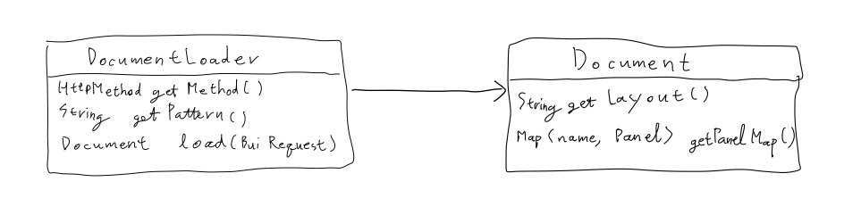
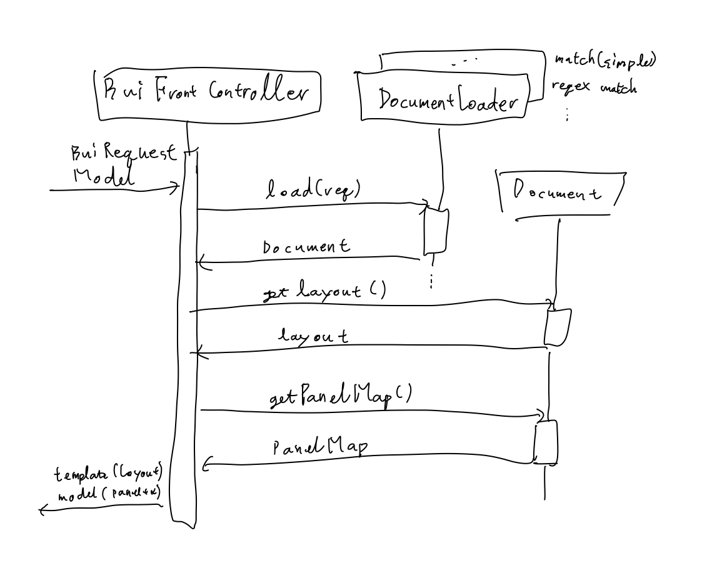

# BUI(Block UI)

HTTP 리퀘스트에 동적으로 HTML을 생성하는 프론트 서버용 프레임워크.

## 구성

매핑된 패스에 맞는 컨트롤러를 찾아 넘겨주면 컨트롤러가 코딩된 로직을 실행하고 템플릿을 반환하는 형식이 아니라,
리퀘스트에 따라 처리할 `DocumentLoader`에 넘겨주면 `DocumentLoader`가 해당 `Document`를 찾아 반환해 도큐먼트가 동적으로 뷰와 모델을 선택한다.

1. 스프링 웹MVC가 HTTP 리퀘스트를 래핑해서 프론트 컨트롤러로 넘겨준다.
1. 프론트 컨트롤러는 등록된 `DocumentLoader`를 순회하며 `Document`를 로딩한다.
1. `Document`에서 뷰와 모델을 가져온다.
  - 해당 도큐먼트가 없다면 `fallback` 도큐먼트로 응답한다.

## 디렉토리

- `db` : DB 관련 파일. ERD, `*.sql` 등.
- `doc` : 프로젝트 문서.
- `web-front` : HTML 템플릿 등 웹 프론트 리소스용 디렉토리.

## I18N

### 메시지

- `components.` : 여러 페이지에서 공유하는 UI 컴포넌트의 메시지.
- `page.` : 특정 URL의 페이지에서만 사용하는 메시지. 페이지 타이틀 등.

### 에러 메시지

- `err.page.` : 특정 페이지에 한정된 에러 메시지.

## DB

### 테이블 이름

- `op_` : 관리자 계정에 관한 정보.
- `ui_` : UI 구성에 필요한 정보.